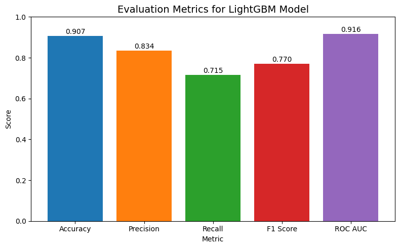
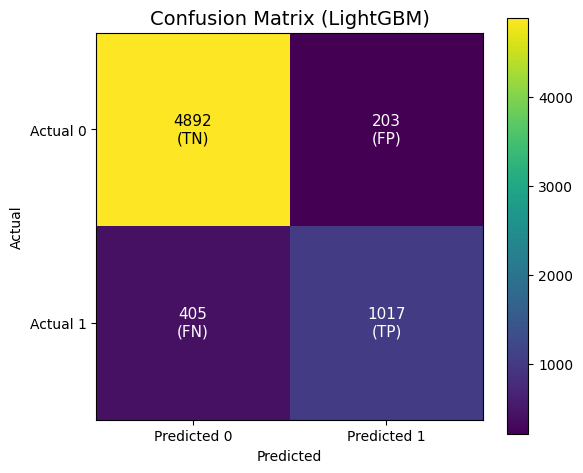
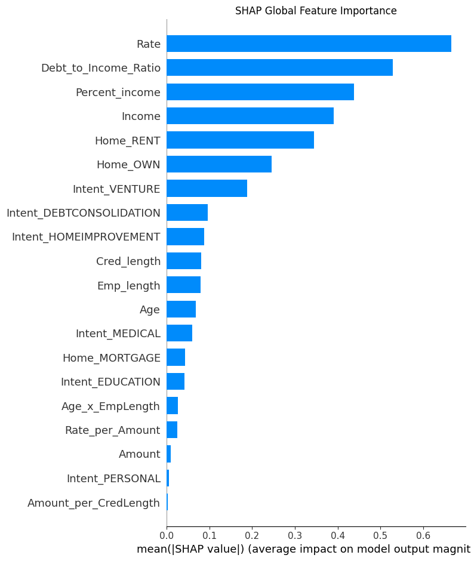
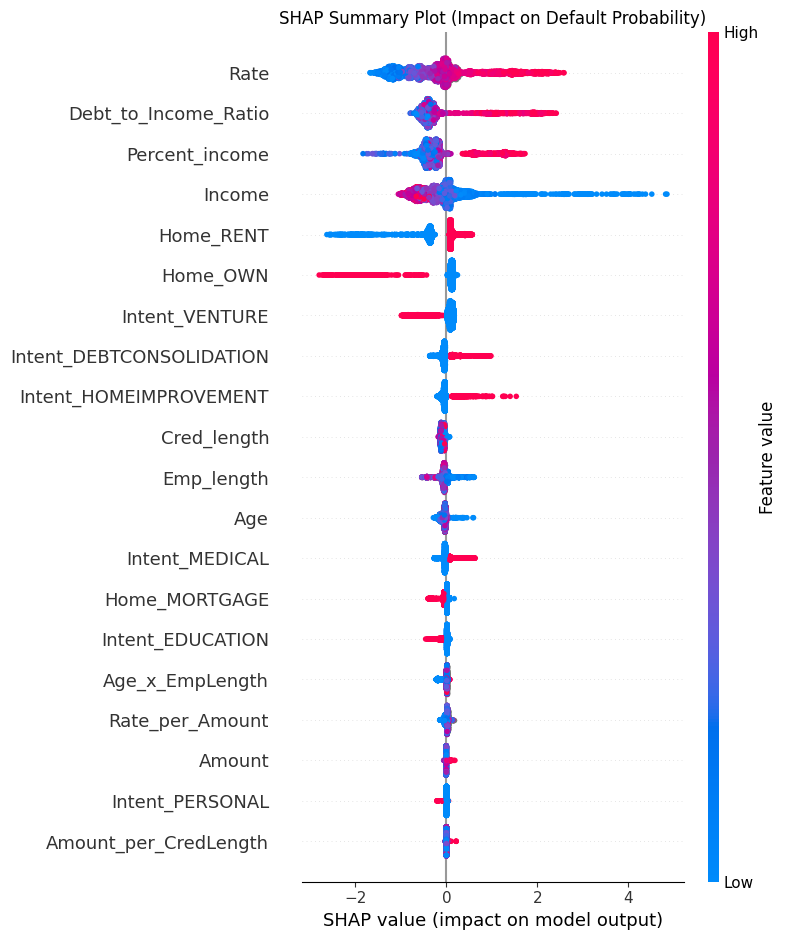
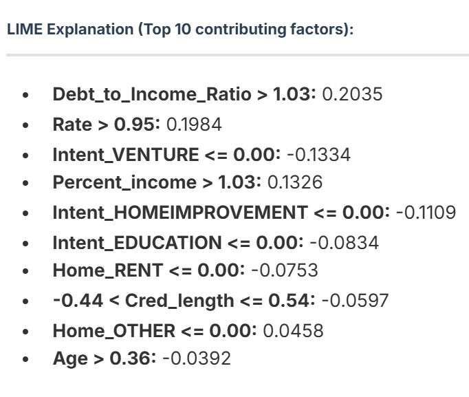

# Explainable Credit Risk Analytics with LightGBM

An Explainable Artificial Intelligence (XAI) framework for Credit Risk Assessment that combines the predictive power of LightGBM with the transparency of SHAP and LIME explanations.

The project is designed to assist financial institutions in evaluating loan applicants while maintaining interpretability, transparency, and regulatory compliance.

---

## Overview

Traditional credit risk assessment systems often struggle to balance predictive performance and interpretability.

This project proposes a hybrid explainability framework that:

* Predicts loan default risk using LightGBM
* Handles class imbalance using SMOTE
* Engineers domain-specific financial features
* Provides global explanations using SHAP
* Provides local explanations using LIME
* Deploys predictions through an interactive Streamlit application

The framework supports human-in-the-loop decision making by generating understandable explanations for every prediction.

---

## Features

### Credit Risk Prediction

Predicts the probability of loan default using a tuned LightGBM classifier.

### Explainable AI (XAI)

#### SHAP

Provides:

* Global feature importance
* Feature impact analysis
* Model auditing capabilities

#### LIME

Provides:

* Instance-level explanations
* Applicant-specific reasoning
* Decision transparency

### Decision Support System

Risk categories:

| Risk Level    | Probability |
| ------------- | ----------- |
| Low Risk      | < 20%       |
| Moderate Risk | 20% – 50%   |
| High Risk     | > 50%       |

Recommended actions:

| Risk Category | Decision |
| ------------- | -------- |
| Low Risk      | Approve  |
| Moderate Risk | Review   |
| High Risk     | Reject   |

### Interactive Streamlit Dashboard

* Real-time applicant assessment
* Probability estimation
* Risk categorization
* Interest rate recommendations
* SHAP explanations
* LIME explanations
* Plain-English decision interpretation

---

## Project Architecture

```text
Raw Dataset
      │
      ▼
Data Preprocessing
      │
      ▼
Feature Engineering
      │
      ▼
SMOTE Balancing
      │
      ▼
Model Training
(Random Forest,
 XGBoost,
 LightGBM)
      │
      ▼
Best Model Selection
(LightGBM)
      │
      ▼
Explainability Layer
(SHAP + LIME)
      │
      ▼
Streamlit Deployment
```

---

## Dataset

Source:

Loan Applicant Data for Credit Risk Analysis

The dataset contains borrower information including:

* Age
* Income
* Home Ownership
* Employment Length
* Credit History Length
* Loan Intent
* Loan Amount
* Interest Rate

Target Variable:

```text
Status
```

* 0 = Non-default
* 1 = Default

---

## Feature Engineering

The following engineered features were created:

| Feature               | Description                         |
| --------------------- | ----------------------------------- |
| Debt_to_Income_Ratio  | Loan Amount / Income                |
| Age_x_EmpLength       | Age × Employment Length             |
| Amount_per_CredLength | Loan Amount / Credit History Length |
| Rate_per_Amount       | Interest Rate / Loan Amount         |
| Income_per_Age        | Income / Age                        |

These features improve both predictive performance and explainability.

---

## Model Training

The following models were evaluated:

* Random Forest
* XGBoost
* LightGBM

After hyperparameter tuning and evaluation, LightGBM achieved the best overall performance.

---

## Performance Results

### Evaluation Metrics



| Metric    | Score |
| --------- | ----- |
| Accuracy  | 0.907 |
| Precision | 0.834 |
| Recall    | 0.715 |
| F1 Score  | 0.770 |
| ROC-AUC   | 0.916 |

### Confusion Matrix



| Actual / Predicted | Non-Default | Default |
| ------------------ | ----------- | ------- |
| Non-Default        | 4892        | 203     |
| Default            | 405         | 1017    |

---

## Explainability Analysis

### SHAP Global Feature Importance



Most influential features:

1. Interest Rate
2. Debt-to-Income Ratio
3. Percent Income
4. Income
5. Home Ownership Type

This analysis provides global insight into model behavior.

---

### SHAP Summary Plot



The SHAP summary plot demonstrates:

* Feature impact magnitude
* Direction of influence
* Distribution of feature effects

This helps auditors and stakeholders understand how features influence default probability.

---

### LIME Local Explanation



LIME provides explanations for individual applicants by identifying the factors that contributed most to a specific prediction.

Example:

* High Debt-to-Income Ratio increased risk
* High Interest Rate increased risk
* Certain Loan Intent categories reduced risk

This enables transparent and defensible loan decisions.

---

## Streamlit Application

The deployed dashboard allows users to:

* Enter applicant information
* Predict default probability
* View risk category
* Receive lending recommendations
* Explore SHAP explanations
* Explore LIME explanations

Run locally:

```bash
streamlit run app.py
```

---

## Installation

Clone the repository:

```bash
git clone https://github.com/yourusername/credit-risk-xai.git
```

Move into the project directory:

```bash
cd credit-risk-xai
```

Install dependencies:

```bash
pip install -r requirements.txt
```

Launch Streamlit:

```bash
streamlit run app.py
```

---

## Technologies Used

### Machine Learning

* LightGBM
* XGBoost
* Random Forest
* Scikit-learn

### Explainable AI

* SHAP
* LIME

### Data Processing

* Pandas
* NumPy

### Deployment

* Streamlit


---

## Future Work

* Real-time credit monitoring
* Fairness and bias analysis
* Counterfactual explanations
* Model drift detection
* Integration with banking APIs
* User-centered trust evaluation

---
